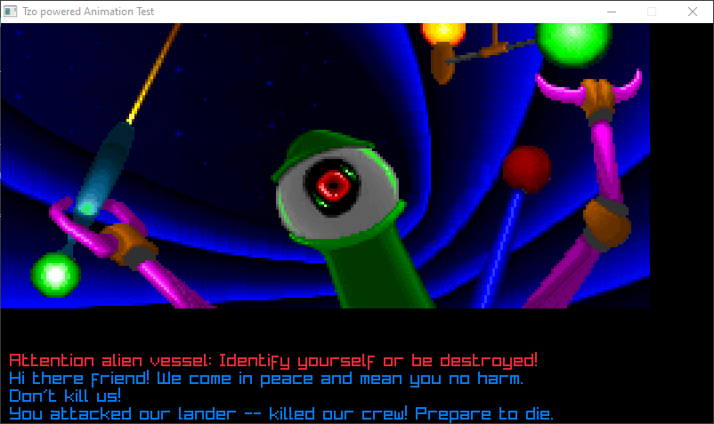

# Tzo-based Animation Test

This is a simple animation test. [uqm-files-parsers](https://github.com/jorisvddonk/uqm-files-parsers) is being used to parse an animation file from [UQM](http://sc2.sourceforge.net/) annotated with UQMAnimationTool animation annotations, which is then compiled to a [Tzo VM](https://github.com/jorisvddonk/tzo) program, and interpreted by the Tzo VM which in turn instructs [node-raylib](https://github.com/RobLoach/node-raylib/) to render relevant sprites when needed.

At the moment, the project is hardcoded to build and display a (partial) implementation of a conversation with Fwiffo. The animation and conversation engine is fully working, but the animation VM bytecode compiler isn't  accurate to UQM's implementation, and the conversation VM bytecode could use a few tweaks as well.

## Running it!

First, ensure you have all dependencies installed
(you'll need to have [node-raylib's dependencies](https://github.com/RobLoach/node-raylib/) installed before doing this!)

`npm ci`

Next, parse the UQM animation file and build the Tzo VM codes:

```
npm run build
npm run build-speech
```

Finally, run the interpreter!

`npm start`

(alternatively, during development, you can generate the VM codes and run the interpreter via `npm run go`)

If everything goes well, you'll see the following:


